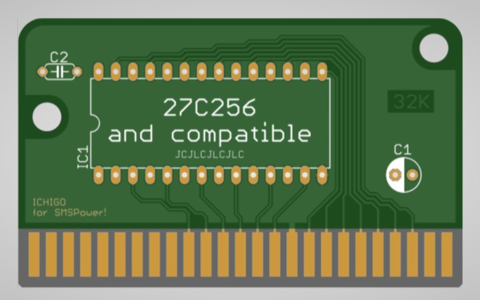

# SMS-basic-32kB-cartridge
<h2>Master System repro 32kB, in DIP format</h2>

DIP (through hole, easy to solder)
BRD files for Eagle, Kicad users or by Oshpark manufacturer.

<strong>COMPONENTS</strong>

Parts:
* IC1: 27C256 or compatible DIP 28 -compare pinout !-
* C1: polarized capacitor 10, 22 or 47uF, 16v, 2.54mm
* C2: ceramic capacitors 100nf, 50v, 5mm

Gerbers files are made for JLC,
but are certainly compatible with others manufacturers
(files are ± standard)
1. Go on https://jlcpcb.com
2. Use Instant Quote button
3. Upload the ZIP file containing gerber files
4. Choose how many boards, color and finition

* PCB Qty : Choose your quantity
* PCB Thickness : 1.6mm
* PCB Color : Choose your color, but can impact the price when finition is not HASL (with lead)
* Surface Finish : Chose the finition, HASL is tin (basic) and ENIG is gold (best)
* Mark on PCB : Order number (specify position) (will be under the component)

Cheers,
ICHIGO
